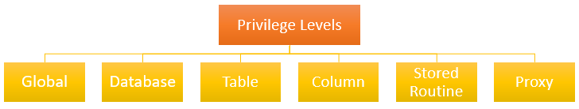

{{ page.description }}

- [Usuarios](#usuarios)
  - [Crear usuarios](#crear-usuarios)
  - [Mostrar usuarios](#mostrar-usuarios)
  - [Eliminar usuarios](#eliminar-usuarios)
  - [Conectarse a la base de datos](#conectarse-a-la-base-de-datos)
- [Privilegios](#privilegios)
  - [Dar privilegios](#dar-privilegios)
  - [Eliminar privilegios](#eliminar-privilegios)
  - [Mostrar privilegios](#mostrar-privilegios)
- [Ejemplos](#ejemplos)

## Usuarios

### Crear usuarios

El nombre de la cuenta se compone del nombre de usuario y el nombre del host a través del cual nos conectamos a la base de datos. En nuestro caso el host es `localhost` ya que trabajamos en un servidor local.

Si no ponemos nada en la parte de host el usuario se crea como `username@%` y se puede conectar desde cualquier host.

```sql
CREATE USER [IF NOT EXISTS] username@hostname 
IDENTIFIED BY 'password';
```

### Mostrar usuarios

```sql
SELECT user FROM mysql.user;
```

### Eliminar usuarios

```sql
DROP USER account_name;
```

### Conectarse a la base de datos

> Esto no funciona desde XAMPP, pero lo dejo a título informativo.

```sql
mysql -u username -p
```

```sql
Enter password: ********
```

## Privilegios

Estos son los privilegios que podemos conceder:

- `SELECT`
- `UPDATE`
- `INSERT`
- `ALL`: todos los privilegios

Los privilegios se pueden conceder a distintos niveles:



<figcaption> Imagen de <a>mysqltutorial.org</a>. </figcaption>

- **Globales**:
  - Afectan a todas las bases de datos dentro de un servidor MySQL.
  - `ON *.*`
- **Base de datos**:
  - Afectan a la totalidad de objetos que se encuentren en una base de datos dada.
  - `ON <database_name>.*`
- **Tabla**:
  - Afecta a todas las columnas de una tabla.
  - `ON <database_name>.<table_name>`
  - En el caso de no incluir el nombre de la base de datos MySQL usará la base de datos por defecto.
- **Columna**:
  - Afecta a una única columna dentro de una tabla.
  - Tiene que indicarse el nombre de la columna para cada permiso que se quiera conceder.
    - `SELECT (<column_name>, ...)`
  - `ON <database_name>.<table_name>`
- Rutina:
  - Permite la ejecución de la rutina.
  - `ON PROCEDURE <procedure_name>`
- Proxy:
  - Permite hacer de un usuario una "copia" de otro, dándole todos sus permisos.

### Dar privilegios

```sql
GRANT privilege [,privilege],.. 
ON privilege_level 
TO account_name;
```

### Eliminar privilegios

```sql
REVOKE privilegee [,privilege]..
ON [object_type] privilege_level
FROM user1 [, user2] ..;
```

### Mostrar privilegios

```sql
SHOW GRANTS FOR super@localhost;
```

## Ejemplos

```sql
CREATE USER ALEX IDENTIFIED BY '1234';
```

Permisos globales:

```sql
-- Damos y retiramos todos los permisos de forma global
GRANT ALL ON *.* TO alex;
REVOKE ALL ON *.* FROM alex; 
```

Permisos en una base de datos concreta:

```sql
-- Damos y retiramos permisos de inserción y selección en todos los elementos de la base de datos 'universidad'
GRANT SELECT, INSERT ON universidad.* TO alex;
REVOKE SELECT, INSERT ON universidad.* FROM alex;
```

Permisos para una única tabla:

```sql
-- Damos y retiramos permisos de inserción y selección en la tabla 'grado' de la base de datos ´universidad´
GRANT SELECT, INSERT ON universidad.grado TO alex;
REVOKE SELECT, INSERT ON universidad.grado FROM alex;
```

Permisos por columnas:

```sql
-- Damos permisos de selección en las columnas 'id' y 'nif' y actualización en la columna 'nif' en la tabla 'persona' de la base de datos ´universidad´
GRANT 
 SELECT (id, nif),
 UPDATE (nif)
ON universidad.persona TO alex;

-- Retiramos el permiso de selección de la columna 'id'
REVOKE SELECT (id) ON universidad.persona FROM alex;
```
